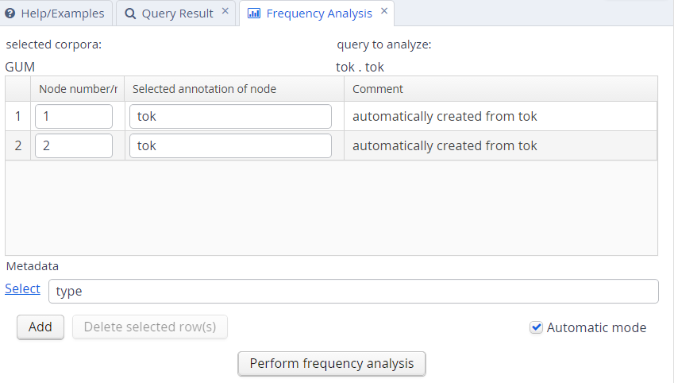
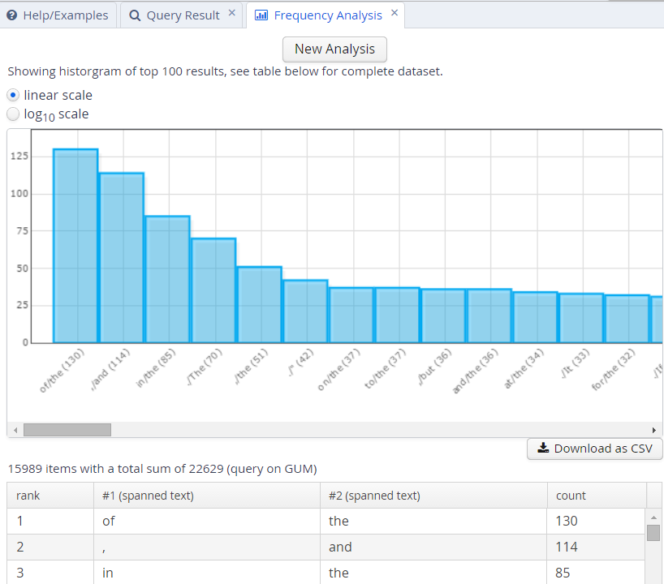
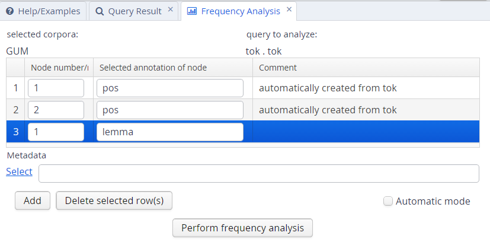

# Frequency Analysis

To perform a frequency analysis, enter the query whose results you want
to analyze as usual in the AQL box. Note that you **do not need to carry
out the query first**. Next, open the menu “More” between the Search and
History buttons and select “Frequency Analysis”:


The interface will open the frequency analysis tab shown below.
Initially, rows will be generated for the nodes present in the query.
For example, two rows are automatically generated for the following
query, which finds any pair of consecutive tokens:
```
tok . tok
```



You may also add metadata to the frequency breakdown from the metadata
selection link. Clicking on “Perform frequency analysis” will produce a
breakdown of all consecutive token bigrams in the corpus. The frequency
graph will only show the first 500 elements, but the table below it will
give the entire list of values, which can also be **exported as a CSV
file**.



To edit the analysis or analyze a new query, click the **New Analysis**
button. It is also possible to **add annotations** to the analysis that
were not in the original query, provided that these are expected to
belong to some other node in the query. For example, the tokens in the
GUM corpus also have part-of-speech and lemma information. We can
replace the lines in the analysis specifying that tok values should be
counted with pos values, which gives us part-of-speech bigrams. We can
also add a lemma annotation belonging to the first search element, by
clicking the Add button and entering the node definition number and
annotation name we are interested in:



As a result, we will get a count for each combination of values grouped
by the first and second tokens' parts-of-speech, as well as the first
token's lemma.