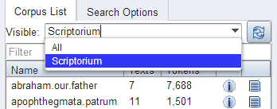

# Multiple Instances of the Interface

## Creating instances

When multiple corpora from different sources are hosted on one server it is often
still desired to group the corpora by their origin and present them differently.
You should not be forced to have an ANNIS frontend and service installation for
each of this groups. Instead the administrator can define so called instances.

An instance is defined by a JSON file inside the instances sub-folder in one of
the *front-end configuration locations*, e.g. the home folder of the user running the ANNIS front-end
 (on a server often the Tomcat user, or under Windows Kickstarter, in
`C:\Users\username\.annis` , or under Mac OSX under `/Users/username/.annis/`,
which is a hidden folder; to view hidden folders you may need to reconfigure your
Finder application).
In ANNIS server scenarios where it is not possible to deploy the
home directory of the user running the front-end (e.g. no home folder for Tomcat), you
may prefer to manually set the configuration path parameter `ANNIS_CFG` for ANNIS,
by adding something like the following to the shell script starting ANNIS
~~~bash
export ANNIS_CFG=/etc/my_annis_cfg_path/
~~~
Instances can then be specified under this folder.
The name of the file also defines the instance name.
Thus the file `instances/falko.json` defines the instance named "falko".

~~~json
{
	"display-name": "Falko",
	"default-querybuilder": "tigersearch",
	"default-corpusset": "falko-essays",
	"corpus-sets": [
	{
		"name": "falko-essays",
		"corpus": [
		"falko-essay-l1",
		"falko-essay-l2"
		]
	},
	{
		"name": "falko-summaries",
		"corpus": [
		"falko-summary-l1",
		"falko-summary-l2"
		]
	}
	],
	"keyboard-layout" : "de",
	"login-on-start": "true"
}
~~~

Each instance configuration can have a verbose display-name which is
displayed in the title of the browser window. `default-querybuilder` defines the
short name of the query builder you want to use. Currently only "tigersearch" and "flatquerybuilder" are
available in the default installation.
The `keyboard-layout` variable is used as the default value for the virtual keyboard of the AQL query box.
If `login-on-start` is set to `true` a login window is shown at each startup of the ANNIS search UI if the user is not logged in yet.

While any user can group corpora into corpus sets for their own, you can define
corpus sets for the whole instance. Each corpus set is an JSON-object with a
name and a list of corpora that belong to the corpus set.

Any defined instance is assigned a special URL at which it can be accessed:
`http://<server>/annis-gui/<instance-name>`. The default instance is
additionally accessible by not specifying any instance name in the URL. You can
configure your web server (e.g. Apache) to rewrite the URLs if you need a more
project specific and less "technical" URL (e.g. `http://<server>/falko`).

## Embedding Web Fonts

It is also possible to set an embedded font for query result display in your instance,
using the same JSON instance file file described in the previous section.
Thus a web font is applied to a specific instance. 
If you not want to define an extra instance, it is possible to add the font configuration to the
`default.json` file in the *instance* directory. If no *instance*
directory or `default.json` file exists, create it. 
Add a property **font** to the config with the following parameters:

~~~json
{
 ...

 "font" :
 {
   "name" : "foo",
   "url": "https://example.com/foo.css",
   "size": "12pt" // optional
 }
}
~~~

You must also provide a css file, which contains the `@font-face` rule
und is reachable under the defined link in the instance config:

~~~css
@font-face {
  font-family: 'bar';
  font-style: normal;
  font-weight: normal;
  font-size: larger;
  src:
	local('bar'),
	url(bar.woff) format('woff');
}
~~~

Further explantation about the `@font-face` rule is available on the [MDN web docs
](https://developer.mozilla.org/en-US/docs/Web/CSS/@font-face).

If you need to have a different font configuration for the frequency chart
just add a `frequency-font` entry. It has the same structure as `font`.

## Using Corpus Groups

It is possible to group corpora into groups, which are selected above the corpus list in
the search form:

While any user can group corpora into corpus sets for their own use, you can define
corpus sets for the whole instance using the "corpus-sets" in the JSON file described
above. Each corpus set is itself a JSON-object with a name and a list of corpora that
belong to the corpus set.