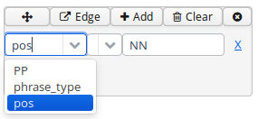
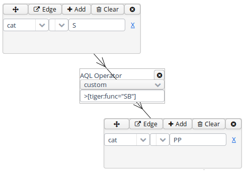

# Query Builder

To open the graphical query builder, click on the **Query Builder**
button. On the left-hand side of the toolbar at the top of the query
builder canvans, you will see the **Add Node** button. Use this button
to define nodes to be searched for (tokens, non-terminal nodes or
annotations). Creating nodes and modifying them on the canvas will
immediately update the AQL field in the Search Form with your query,
though updating the query on the Search Form will not create a new graph
in the Query Builder.

In each node you create you may click on  to specify an annotation value. The annotation
name can be typed in or selected from a drop down list once a corpus is
selected. The operator field in the middle allows you to choose between
an exact match (the \'=\' symbol) or wildcard search using Regular
Expressions (the \'\~\' symbol). The annotation value is given on the
right, and should **NOT** be surrounded by quotations (see the example
below). It is also possible to specify multiple annotations applying to
the same position by clicking on 
multiple times. Clicking on  will delete the values in the node. To search
for word forms, simply choose \"tok\" as the field name on the left. A
node with no data entered will match any node, that is an underspecified
token or non-terminal node or annotation.

To specify the relationship between nodes, first click on the \"Edge\"
link at the top left of one node, and then click the \"Dock\" link which
becomes available on the other nodes. An edge will connect the nodes
with an extra box from which operators may be selected (see below). For
operators allowing additional labels (e.g. the dominance operator `>`
allows edge labels to be specified), you may type directly into the
edge\'s operator box, as in the example with a \"func\" label in the
image below. Note that the node clicked on first (where the \"Edge\"
button was clicked) will be the first node in the resulting quey, i.e.
if this is the first node it will dominate the second node (`#1 > #2`)
and not the other way around, as also represented by the arrows along
the edge.

