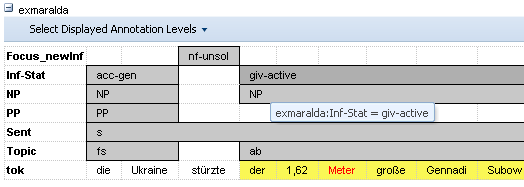
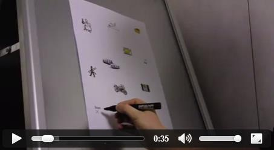

# List of Visualizations

## `kwic` 

Default key-word in context view.

## `tree` 

Constituent syntax tree.

## `grid` 

Annotation grid, with annotations spanning multiple tokens.

## `grid_tree` 
    
A grid visualizing hierarchical tree annotations as ordered grid layers.

***Note:***  all layers represent the same annotation name at different hierarchical depths, marked level: 0,1,2,... etc. on the left

## `discourse` 

A view of the entire text of a document, possibly with interactive coreference links.

It is possible to use this visualization to view entire texts even if you do not have coreference annotations)

## `arch_dependency`

Dependency tree with labeled arches between tokens;
requires SVG enabled browser.

## `audio`

A linked audio file.

## `video`

A linked video file.

## `pdf` or `pdfdoc`

A linked pdf file, showing either a specific page aligned
with an annotation or an entire pdf document respectively.

## `rst` or `rstdoc`

A visualization for rhetorical structure theory annotations,
of either just the search result with context or the entire document
respectively.

## `html` or `htmldoc` 

A versatile annotation-triggered css-based visualization
of either the immediate search result context or the entire document
respectively; see the ANNIS HTML Visualization Guide for more
details and some example stylesheets.

